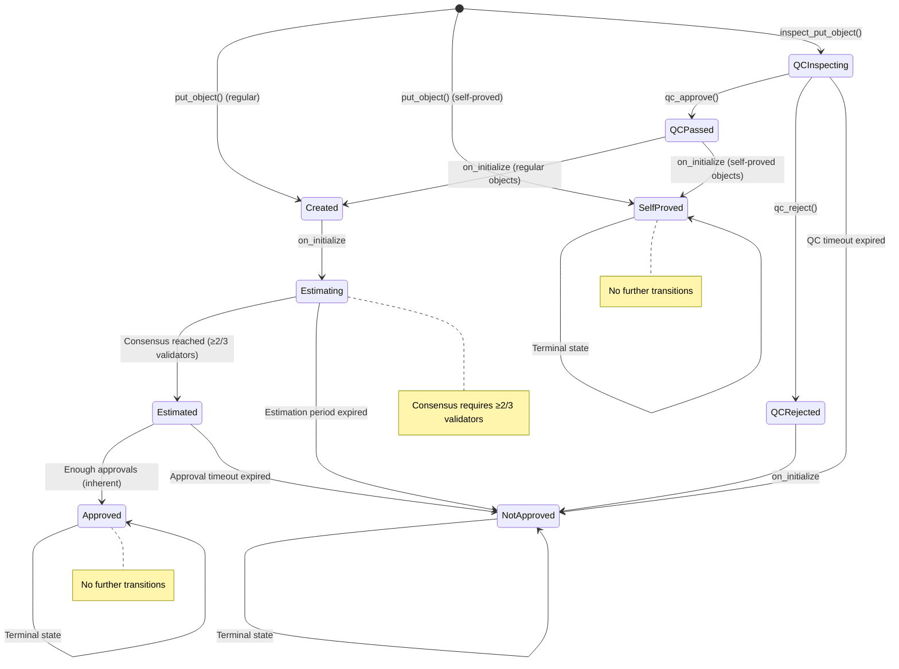

# PoScan pallet (3DPRC-2 implementation)

[3DPRC-2](https://github.com/3Dpass/whitepaper/blob/main/3DPRC-2.md) (3Dpass Request for Comments), proposed by PaulS in September 2023, is a standard p2p protocol for the authentication of objects operating within “The Ledger of Things”.

The PoScan pallet is integrated into 3dpass network runtime providing the access to the network decentralized storage by means of the object authentication API, which allows for:
- the user object authentication and its protection from being copied to the extent for the recognition algorithm precision;
- non-fungible digital asset creation;
- property rights definition and its transfers;

## API

### 1. poscan.putObject

This method allows for users to put an object onto the poScan storage, which triggers the object authentication procedure resulting as either `Approved` or `NotApproved`. (see more THE OBJECT AUTHENTICATION PROTOCOL). 

- If `Approved`, the object will be allowed for any further operation with the asset (property rights transfers, backed currency issuance, etc), and the copy protection will be applied. The object will be available on the network storage with all the authentication history data attached.

- `NotApproved` keeps the object and all the authentication history data available on the network storage, however, all further operations will be prohibited, and the copy protection will not be applied.

```
putObject(
    category,
    is_private,
    obj,
    numApprovals,
    hashes,
    properties,
    is_replica,
    original_obj,
    sn_hash,
    is_self_proved,
    proof_of_existence,
    ipfs_link
)
```

**Parameters:**
- `category`: The object category (e.g., `Objects3D:Grid2dLow`, `Objects3D:Grid2dHigh`, etc.).
- `is_private`: Boolean. If true, the object is private and only accessible to permitted users.
- `obj`: The object data to tokenize (e.g., a 3D model in .obj format), as a byte array.
- `numApprovals`: Number of block author approvals required (u8, 1-255).
- `hashes`: Optional. List of up to 10 object hashes (e.g., top 10 Grid2D output hashes).
- `properties`: List of object properties for tokenization. Each property is `{ propIdx: u32, maxValue: u128 }`.
- `is_replica`: Boolean. If true, this object is a replica of another.
- `original_obj`: Optional. The object index of the original object if this is a replica.
- `sn_hash`: Optional. Serial number hash for replicas (u64).
- `is_self_proved`: Boolean. If true, the object is self-proved and skips estimation/approval.
- `proof_of_existence`: Optional. Hash proving the object's existence (H256). Auto-calculated if not provided and `is_self_proved` is true.
- `ipfs_link`: Optional. IPFS link to the object or related data (byte array, max 512 bytes).

---

### 2. poscan_getPoscanObject

The objects are getting compressed with zip, before they are put on the storage. This method allows to get the object and its history unzipped. 

```
curl -H "Content-Type: application/json" -d 
'{"id":1, 
"jsonrpc":"2.0",
"method": "poscan_getPoscanObject",
"params": [0]
}' http://localhost:9933/
```
- Where the `"params": [0]` is the object index value

The output provides `result` parameter containing the object itself and all the history related to:

```
{"jsonrpc":"2.0","result":
{"state":{
      "Approved":101
    },
"obj"[
111,32,10,118,32,48,46,48,57,32,48,46,56,50,32,45,48,46,48,49,10,118,32,48,46,48,56,32,48,46,56,49,32,48,46,48,51...
    ],
"compressed_with":null,
"category":
   {
     "Objects3D":"Grid2dLow"
   },
"hashes":[
"0x2c998a9919725d59e477fcb823f811e1ac5806722653906f5b5d7ec933ef6bdf",
"0x80af29c76bf63b639efd8fe8ce368a27266d538de0a47a39725bc0bb0e13a865",
"0xb46a7668a64c09b19ff9f42e9b68d78268f11715a35ca125ddf48bceee5097e4",
"0xd9d8dbf4258bc7de9c7de7ac5d5dbec806bcb04ca995fd133482390f047003bc",
"0x8d1b99511af0a0c6cb43a7546b75fd7d7a247cbd3e4a6259ac0b28cff67172a2",
"0x24aad89b485f3e84c4c37e1ba26355c577879123bb02fb010f576ac352ce88b1",
"0x0691088a9b80ca199efb27a06a043a35500de3807d55757590130547f5bb24f7",
"0xfaf0c5025b9573c0a06ce7f0c7e3737717005f92866f0f25b45b57cb400b90c2",
"0x76c10fcff1dfda6c3ee665396f61543a26bdd9f73bf4b656f116495aecc9f53b",
"0xe465088c87c5c8cf2f33436ee0152107439bdb97335920abeff19d1c3eb6abf7"
],
"when_created":91,
"when_approved":101,
"owner":"d7f5KGsoZ3xzB6Ecmv92DPizD1x5eToNHM1CPfSC1Xu4nzecN",
"estimators":[
     [
       "d1ePg4fK97U913xAnZzZ9dUf1W1XUA4bYVC2Zre8K9vjSixnc",
       53
     ],
     [
       "d1asoD7V6hdff4ExvtjRbdVT398Rg8fKEruYsKFS5P9mkT4fy",
       5
     ]
   ],
"est_outliers":[],
"approvers":[ 
     {
       "account_id":"d1ePg4fK97U913xAnZzZ9dUf1W1XUA4bYVC2Zre8K9vjSixnc",
       "when":96,
       "proof":"0x93b64823cb53e8c08b1ddf1b30bed611b11e0912b3b28aa3e122b2fb5d418be8"
     },      
     {
       "account_id":"d1ePg4fK97U913xAnZzZ9dUf1W1XUA4bYVC2Zre8K9vjSixnc",
       "when":97,
       "proof":"0xcff4f0b718ee26934fa6a7739e2111d307e2e7be491047277160f92bd5dee1fb"
     },  
    {
       "account_id":"d1ePg4fK97U913xAnZzZ9dUf1W1XUA4bYVC2Zre8K9vjSixnc",
       "when":98,
       "proof":"0xa0de6a64564f85e481fe8fbea5f8c6ddf13b3e7e66c00254f27a290407d1d99b"
     },
    {
       "account_id":"d1ePg4fK97U913xAnZzZ9dUf1W1XUA4bYVC2Zre8K9vjSixnc",
       "when":99,
       "proof":"0x961d9110c11ceb62c447edb8576fc8721550a829814e8f69e1732f5e101e5dd4"
    },
    {
       "account_id":"d1ePg4fK97U913xAnZzZ9dUf1W1XUA4bYVC2Zre8K9vjSixnc",
       "when":100,
       "proof":"0x9dec30de83339dffa02093cf5c2d3e110c47e2f9dc05a237f73af8cae6b89b0f"
    },
    {
"account_id":"d1ePg4fK97U913xAnZzZ9dUf1W1XUA4bYVC2Zre8K9vjSixnc",
"when":101,
"proof":"0x145f0fd64c2865e05f5a727d6dc316ac6164111a785b5bba8ff4fddec1c03171"
    }
],
"num_approvals":6,
"est_rewards":70000000000000000,
"author_rewards":30000000000000000
"prop": [
        {
          "propIdx": 0,
          "maxValue": 1
        }
      ]
 }
}
```

Whereas the following parameters supplied:

- `state: {Status: blockN}` - current status of the authentication process. Possible states include:
  - `Created(blockN)` - Object created and waiting for estimation
  - `Estimating(blockN)` - Object is being estimated by validators
  - `Estimated(blockN, time)` - Estimation completed with average processing time
  - `NotApproved(blockN)` - Object was not approved (expired or rejected)
  - `Approved(blockN)` - Object was approved by consensus
  - `QCInspecting(inspector, blockN)` - Object is under QC inspection by inspector
  - `QCPassed(inspector, blockN)` - Object has passed QC inspection
  - `QCRejected(inspector, blockN)` - Object has been rejected by QC
  - `SelfProved(blockN)` - Object is self-proved (replica with proof of existence)
- `obj:` - the object submitted by user (ex. 3D model in .obj format)
- `compressed_with: Option<CompressWith>` - compression method used (e.g., Lzss) or null if not compressed
- `category: {Objects3D: Grid2dLow}` - the object category and the algorithm preset used for its authentication
- `is_private: bool` - whether the object is private and requires permissions for replicas
- `hashes:[]` - the HASH ID submitted by user (ex. the top 10 hashes from Grid2d output)
- `whenCreated: blockN` - the block number the object was created at
- `whenApproved: blockN` - the block number the object was approved at (null if not approved)
- `owner: P3D address` - the object owner (initially, this is a P3D account the object was submitted with)
- `estimators: [P3D address, time in mSec]` - the list of Validators (P3D addresses), who voted for the object to pass the estimation threshold (2/3 validators out of the number of validators in the set), the object processing time provided
- `estOutliers:[P3D address, time in mSec]` - the validators ruled out of vote, due to the weird processing time
- `approvers:[{"account_id":P3D address,"when":blockN, "proof":hash}]` - the list of block authors (miners) provided their judgement on the object authenticity. `"proof":hash` - is a "zero knowledge proof" hash (ex. the 11th hash of Grid2D output in sha256) 
- `numApprovals: N` - the number of confirmations ordered by user
- `estRewards: 70,000,000,000,000,000` - the validator share of rewards in minimum indivisible units “Crumbs”, 1 Crumb = 0.0000000000001 P3D), which is to be distributed among the validators(estimators)
- `authorRewards: 30,000,000,000,000,000` - the block author share of rewards in minimun indivisible units “Crumbs”, which is to be distributed among the the miners (approvers)
- `prop: [{"propIdx": u32, "maxValue": u128}]` - the list of the object properties (inherent to the object).
  - `propIdx: u32` - the property index on the `poScan` module storage (ex, `0` - Non-fungible; `1` - Share)
  - `maxValue: u128` - Max Supply limit for tokens, backed by this property (might be issued, if having the object `Approved`).
- `is_replica: bool` - whether this object is a replica of another object
- `original_obj: u32` - the object index of the original object if this is a replica (null if not a replica)
- `sn_hash: u64` - serial number hash for replicas (null if not a replica)
- `inspector: P3D address` - the inspector assigned for QC inspection (null if not under QC)
- `is_ownership_abdicated: bool` - whether object ownership has been abdicated (irreversible)
- `is_self_proved: bool` - whether this object is self-proved (skips estimation/approval process)
- `proof_of_existence: H256` - hash proving the object's existence (null if not self-proved)
- `ipfs_link: string` - IPFS link to the object or related data (null if not provided)
- `fee_payer: P3D address` - the account that will be charged for verification fees
- `inspector_fee: u128` - inspector fee reserved for QC inspection (in Crumbs)
- `qc_timeout: u32` - custom QC timeout in blocks (5-100,000, default from configuration)

---

### 3. poscan.approve

This method is utilized by new block authors (miners) to provide their judgement on objects “Estimated” (after the estimation procedure, performed by Validators, is completed successfully). If the estimation procedure was not successful or fully complete (ex, the object is still at “Estimating” or “Created”), the judgement and the block will be rejected by the majority of the network.

```
approve(
    author, 
    objIdx, 
    proof
)
```
**Parameters:**
- `author`: AccountId of the block author (address).
- `objIdx`: Index of the object to approve (u32).
- `proof`: Optional. Zero-knowledge proof hash (H256).

---

### 6. poscan.inspectPutObject

Submit an object for QC (Quality Control) inspection, specifying an inspector, inspector fee, and custom timeout. The object enters a QC inspection state and must be approved or rejected by the inspector.

```
inspectPutObject(
    category,
    is_private,
    obj,
    numApprovals,
    hashes,
    properties,
    is_replica,
    original_obj,
    sn_hash,
    inspector,
    inspector_fee,
    qc_timeout,
    is_self_proved,
    proof_of_existence,
    ipfs_link
)
```
**Parameters:**
- All parameters as in `putObject`, plus:
- `inspector`: AccountId of the inspector (address).
- `inspector_fee`: Fee to be reserved and paid to the inspector (balance).
- `qc_timeout`: Custom timeout (in blocks) for the QC inspection phase.

---

### 7. poscan.qcApprove

Called by the inspector to approve an object under QC inspection. The inspector receives the reserved inspector fee.

```
qcApprove(
    objIdx
)
```
**Parameters:**
- `objIdx`: Index of the object under QC inspection (u32).

---

### 8. poscan.qcReject

Called by the inspector to reject an object under QC inspection. The inspector still receives the reserved inspector fee.

```
qcReject(
    objIdx
)
```
**Parameters:**
- `objIdx`: Index of the object under QC inspection (u32).

---

### 9. poscan.setPrivateObjectPermissions

Allows the owner of a private object to set or update permissions for who can create replicas of the object.

```
setPrivateObjectPermissions(
    objIdx,
    permissions
)
```
**Parameters:**
- `objIdx`: Index of the private object (u32).
- `permissions`: List of permissions (who, until, max_copies, etc.).

---

### 10. poscan.transferObjectOwnership

Transfers ownership of an object to another account, if allowed (e.g., no associated asset, not abdicated).

```
transferObjectOwnership(
    objIdx,
    newOwner
)
```
**Parameters:**
- `objIdx`: Index of the object to transfer (u32).
- `newOwner`: AccountId of the new owner (address).

---

### 11. poscan.abdicateTheObjOwnership

Allows the owner to irreversibly abdicate ownership of an object.

```
abdicateTheObjOwnership(
    objIdx
)
```
**Parameters:**
- `objIdx`: Index of the object to abdicate (u32).

---

### 12. poscan.setAlgoTime

Sets the maximum allowed time for object processing (Council/admin only).

```
setAlgoTime(
    algoTime
)
```
**Parameters:**
- `algoTime`: Maximum allowed time for object processing (u32, in seconds).

---

### 13. poscan.setFeePerByte

Sets the fee per byte for object authentication (Council/admin only).

```
setFeePerByte(
    fee
)
```
**Parameters:**
- `fee`: Fee per byte for object authentication (u64).

---

### 14. poscan.addPropertyType

Adds a new property type that can be associated with objects (admin only).

```
addPropertyType(
    name,
    class,
    maxValue
)
```
**Parameters:**
- `name`: Name of the property (string/byte array, max 64 bytes).
- `class`: Property class (e.g., Relative, Absolute).
- `maxValue`: Maximum value for the property (u128).

---

### 15. poscan.setDynamicRewardsGrowthRate

Sets the dynamic rewards growth rate for estimators (Council only).

```
setDynamicRewardsGrowthRate(
    growthRate
)
```
**Parameters:**
- `growthRate`: Dynamic rewards growth rate (u32, recommended 1-100).

---

### 16. poscan.setRewards

Sets the base rewards for object authentication (Council only).

```
setRewards(
    rewards
)
```
**Parameters:**
- `rewards`: Base rewards for object authentication (balance).

---

### 17. poscan.unlockUnspentRewards

Allows the fee payer to unlock and reclaim unspent rewards for a NotApproved object.

```
unlockUnspentRewards(
    objIdx
)
```
**Parameters:**
- `objIdx`: Index of the NotApproved object (u32).

---

### 18. poscan.setAuthorPart

Sets the percentage of rewards allocated to authors (Council only).

```
setAuthorPart(
    part
)
```
**Parameters:**
- `part`: Percentage of rewards allocated to authors (Percent type).

---

## Dynamic Rewards Formula

The PoScan pallet uses a dynamic rewards formula to incentivize validators based on the current queue size of objects waiting for processing. The formula increases rewards as the queue grows, encouraging faster processing during periods of high demand.

**Formula:**

```
dynamic_rewards = base_rewards * (1 + sqrt(queue_size) / growth_rate)
```

- `base_rewards`: The base reward amount (set by governance).
- `queue_size`: The number of objects currently in the queue (states: Created, Estimating, or QCInspecting).
- `growth_rate`: A configurable parameter (set by governance) that controls how quickly rewards increase with queue size. Higher values mean slower growth.

**Explanation:**
- If there are no objects in the queue, the dynamic rewards equal the base rewards.
- As the queue size increases, the rewards grow according to the square root of the queue size, divided by the growth rate.
- This mechanism helps balance validator incentives and network throughput.


# PoScan Flow Documentation

## Overview

The document below describes all state transitions, object types, and validation flows.

## Object Types

### 1. Regular Objects
- **Purpose**: Standard object tokenization with full validation
- **Storage**: Full object data (compressed)
- **Rewards**: Estimator and author rewards
- **Validation**: Full consensus-based approval process
- **Duplication**: Strict duplicate detection

### 2. Replicas
- **Purpose**: Copies of approved original objects
- **Storage**: Proof of existence only (no object data)
- **Rewards**: No rewards (self-proved)
- **Validation**: Immediate approval (self-proved)
- **Duplication**: Exempt from duplicate detection
- **Constraint**: Must be self-proved

### 3. Self-Proved Objects
- **Purpose**: Storage-efficient private object representation
- **Storage**: Proof of existence only
- **Rewards**: No rewards
- **Validation**: Immediate approval
- **Duplication**: Subject to duplicate detection (if not replica)
- **Constraint**: Can be either regular objects or replicas

## State Transitions

### Object States

```rust
enum ObjectState<Block, Account> {
    Created(Block),                    // Initial state for regular objects
    QCInspecting(Account, Block),      // Under QC inspection
    QCPassed(Account, Block),          // QC inspection passed
    QCRejected(Account, Block),        // QC inspection failed
    Estimating(Block),                 // Under consensus estimation
    Estimated(Block, u64),             // Consensus reached, waiting for approval
    NotApproved(Block),                // Final rejection state
    Approved(Block),                   // Final approval state
    SelfProved(Block),                 // Terminal state for self-proved objects
}
```

### State Transition Diagram



## Flow Types

### 1. Normal Flow (put_object)

**Purpose**: Standard object submission and validation

**Flow Steps**:
1. **Object Submission**: User submits object via `put_object()`
2. **Initial Validation**: Duplication check, property validation
3. **State Assignment**: 
   - Regular objects → `Created`
   - Self-proved objects → `SelfProved` (terminal)
4. **Consensus Process**: 
   - `Created` → `Estimating` (automatic)
   - Validators provide estimation times
   - Consensus reached when ≥2/3 validators participate
5. **Approval Process**:
   - `Estimated` → `Approved` (via inherent system)
   - Block authors automatically approve eligible objects
6. **Final State**: `Approved` (terminal)

**Validation Checks**:
- Duplication detection (for regular objects)
- Property validation
- Balance checks
- Hash calculation

### 2. QC Inspector Flow (inspect_put_object)

**Purpose**: Quality control inspection before consensus

**Flow Steps**:
1. **QC Submission**: User submits object via `inspect_put_object()`
2. **Inspector Assignment**: Object assigned to specific inspector
3. **Fee Reservation**: Inspector fee reserved from submitter
4. **Initial State**: `QCInspecting`
5. **QC Process**: Inspector reviews and decides
6. **QC Decision**:
   - **Approved**: `QCInspecting` → `QCPassed`
   - **Rejected**: `QCInspecting` → `QCRejected`
   - **Timeout**: `QCInspecting` → `NotApproved`
7. **Post-QC Transition**:
   - `QCPassed` → `Created` (regular objects)
   - `QCPassed` → `SelfProved` (self-proved objects)
   - `QCRejected` → `NotApproved`
8. **Normal Flow**: Continues through consensus process if `Created`

**Validation Checks**:
- Same as normal flow
- Inspector fee validation
- QC timeout validation

## Duplication Checks

### Duplication Detection Logic

```rust
fn find_dup(maybe_obj_idx: Option<ObjIdx>, hashes: &Vec<H256>) -> Option<ObjIdx> {
    for (idx, obj) in Objects::<T>::iter() {
        if let Some(obj_idx) = maybe_obj_idx {
            if idx == obj_idx { continue } // Skip self
        }
        if matches!(obj.state, ObjectState::Approved(_)) { // Only check against approved objects
            let min_len = core::cmp::min(hashes.len(), obj.hashes.len());
            if hashes.iter().eq(obj.hashes[0..min_len].iter()) {
                return Some(idx) // Duplicate found
            }
        }
    }
    None
}
```

### Duplication Check Locations

| Location | Regular Objects | Replicas | Self-Proved |
|----------|----------------|----------|-------------|
| **Object Submission** | ✅ Checked | ❌ Exempt | ✅ Checked |
| **Approval Process** | ✅ Checked | ❌ Exempt | ✅ Checked |
| **Inherent Validation** | ✅ Checked | ❌ Exempt | ✅ Checked |

### Replica Hash Validation

Replicas have special hash validation:
```rust
// At least one hash must match original
let match_found = hashes.iter().any(|h| orig.hashes.contains(h));
if !match_found {
    return Err(Error::<T>::NotAReplica.into());
}
```

## Object Type Constraints

### Regular Objects
- **Duplication**: Strict duplicate detection
- **Storage**: Full object data (compressed)
- **Rewards**: Full reward system
- **Validation**: Complete consensus process
- **Self-Proved**: Optional

### Replicas
- **Duplication**: Exempt from duplicate detection
- **Storage**: Proof of existence only
- **Rewards**: No rewards (self-proved)
- **Validation**: Immediate approval
- **Self-Proved**: **Mandatory**
- **Original**: Must reference approved object
- **Hash Matching**: Must have at least one matching hash

### Self-Proved Objects
- **Duplication**: Subject to duplicate detection (if not replica)
- **Storage**: Proof of existence only
- **Rewards**: No rewards
- **Validation**: Immediate approval
- **State**: Terminal state (`SelfProved`)

## Validation Conditions

### Object Submission Validation

#### Regular Objects
1. **Balance Check**: Sufficient balance for fees
2. **Duplication Check**: No duplicate hashes with approved objects
3. **Property Validation**: Valid property values
4. **Hash Generation**: Calculate object hashes
5. **Reward Locking**: Lock rewards for consensus process

#### Replicas
1. **Original Validation**: Original object exists and is approved
2. **Hash Matching**: At least one hash matches original
3. **Permission Check**: Copy permissions for private originals
4. **Serial Number**: Valid serial number (if provided)
5. **Self-Proved Enforcement**: Must be self-proved
6. **No Duplication Check**: Exempt from duplicate detection

#### Self-Proved Objects
1. **Proof Generation**: Auto-generate proof of existence
2. **No Storage**: Don't store actual object data
3. **No Rewards**: Zero rewards
4. **Immediate Approval**: Terminal state

### QC Inspection Validation

#### Additional Checks
1. **Inspector Fee**: Sufficient balance for inspector fee
2. **QC Timeout**: Valid timeout period (5-100,000 blocks)
3. **Inspector Assignment**: Valid inspector account
4. **Fee Reservation**: Reserve inspector fee

### Consensus Validation

#### Estimation Process
1. **Validator Participation**: Collect estimation times from validators
2. **Outlier Detection**: Remove statistical outliers
3. **Consensus Threshold**: ≥2/3 of total validators must participate
4. **Average Calculation**: Calculate average estimation time
5. **Reward Distribution**: Distribute rewards to valid estimators

#### Approval Process
1. **Eligibility Check**: Object must be in `Estimated` state
2. **Timeout Check**: Within approval timeout period
3. **Hash Validation**: Validate object hashes
4. **Duplicate Check**: Check for duplicates during approval
5. **Reward Distribution**: Distribute author rewards

## Error Conditions

### Object Submission Errors
- `ObjectExists`: Object already exists
- `DuplicatedHashes`: Duplicate hashes detected
- `ZeroApprovalsRequested`: No approvals requested
- `UnsufficientBalance`: Insufficient balance
- `UnsupportedCategory`: Unsupported object category
- `NoHashes`: No hashes provided
- `OriginalNotFound`: Original object not found (replicas)
- `OriginalNotApproved`: Original not approved (replicas)
- `NotAReplica`: No matching hashes with original (replicas)
- `NotPermitted`: No copy permission (private originals)
- `SerialNumberNotFound`: Serial number not found
- `SerialNumberAlreadyUsed`: Serial number already used
- `SerialNumberExpired`: Serial number expired
- `SerialNumberNotOwner`: Not owner of serial number
- `ReplicaMustBeSelfProved`: Replica must be self-proved

### QC Inspection Errors
- `NotInspector`: Caller is not the assigned inspector
- `NotQCInspecting`: Object not in QC inspection state
- `QCTimeoutTooShort`: QC timeout too short (< 5 blocks)
- `QCTimeoutTooLong`: QC timeout too long (> 100,000 blocks)

### Approval Errors
- `ObjectNotFound`: Object not found
- `NotOwner`: Not the object owner
- `ObjectHasAsset`: Object has associated asset
- `OwnershipAbdicated`: Object ownership abdicated

## Reward System

### Regular Objects
- **Estimator Rewards**: Distributed to validators who participated in estimation
- **Author Rewards**: Distributed to block authors who approve objects
- **Dynamic Rewards**: Rewards scale based on queue size

### Self-Proved Objects
- **No Rewards**: Zero rewards (no work performed)
- **No Storage Fees**: Minimal storage costs

### Replicas
- **No Rewards**: Inherit self-proved characteristics
- **No Storage Fees**: Proof of existence only

## Timeout Periods

### Estimation Period
- **Purpose**: Time limit for consensus estimation
- **Default**: Configurable via `EstimatePeriod`
- **Effect**: Objects expire to `NotApproved` if consensus not reached

### Approval Timeout
- **Purpose**: Time limit for approval after estimation
- **Default**: Configurable via `ApproveTimeout`
- **Effect**: Objects expire to `NotApproved` if not approved

### QC Timeout
- **Purpose**: Time limit for QC inspection
- **Range**: 5-100,000 blocks
- **Effect**: Objects expire to `NotApproved` if inspection not completed

## API Functions

### Core Functions
- `put_object()`: Submit regular or self-proved objects
- `inspect_put_object()`: Submit objects for QC inspection
- `qc_approve()`: Approve object in QC inspection
- `qc_reject()`: Reject object in QC inspection
- `approve()`: Approve object (inherent system)

### Query Functions
- `replicas_of()`: Get all replicas of an original object
- `get_poscan_object()`: Get object data
- `is_owner_of()`: Check object ownership
- `property()`: Get object property value

### Management Functions
- `transfer_object_ownership()`: Transfer object ownership
- `abdicate_the_obj_ownership()`: Abdicate object ownership
- `set_private_object_permissions()`: Set copy permissions
- `unlock_unspent_rewards()`: Unlock unspent rewards

## Migration Support

### v2/v3 to v4 Migration
- **Storage Version**: 4
- **New Fields**: Added replica, self-proved, and QC-related fields
- **State Mapping**: Maps old 5-variant states to new 9-variant states
- **Default Values**: Initializes new fields with appropriate defaults

## Security Considerations

### Duplication Protection
- **Approved Objects Only**: Duplication checks only against approved objects
- **Hash-Based Detection**: Uses cryptographic hashes for duplicate detection
- **Replica Exemption**: Replicas are exempt to allow legitimate copies

### Permission System
- **Private Objects**: Require explicit copy permissions
- **Serial Numbers**: Provide licensing and tracking capabilities
- **Ownership Control**: Transfer and abdication mechanisms

### Consensus Security
- **Validator Participation**: Requires ≥2/3 validator consensus
- **Outlier Detection**: Removes statistical outliers from estimation
- **Inherent System**: Automatic approval prevents manipulation

### Fee Security
- **Reservation System**: Fees reserved before processing
- **Refund Mechanism**: Unspent rewards can be unlocked
- **Validator Distribution**: Storage fees distributed to validators

## Serial Number Conditions

### Overview

Serial numbers provide a licensing and tracking mechanism for replicas, allowing controlled distribution of object copies with unique identifiers.

### Serial Number Validation

#### Required Conditions for Replicas with Serial Numbers

```rust
// Serial number checks for replicas
if let Some(sn_idx) = sn_hash {
    // a. Serial number exists
    let sn_details = T::SerialNumbers::get_serial_numbers(Some(sn_idx));
    let sn_details = sn_details.get(0).ok_or(Error::<T>::SerialNumberNotFound)?;
    
    // b. Serial number is not used
    if T::SerialNumbers::is_serial_number_used(sn_details.sn_hash) {
        return Err(Error::<T>::SerialNumberAlreadyUsed.into());
    }
    
    // c. Serial number is not expired
    if sn_details.is_expired {
        return Err(Error::<T>::SerialNumberExpired.into());
    }
    
    // d. Serial number owner matches object owner
    if sn_details.owner != acc {
        return Err(Error::<T>::SerialNumberNotOwner.into());
    }
}
```

#### Validation Rules

| Condition | Error | Description |
|-----------|-------|-------------|
| **Serial Number Exists** | `SerialNumberNotFound` | Serial number must exist in the system |
| **Not Already Used** | `SerialNumberAlreadyUsed` | Serial number cannot be used for multiple replicas |
| **Not Expired** | `SerialNumberExpired` | Serial number must be within valid period |
| **Owner Match** | `SerialNumberNotOwner` | Replica owner must own the serial number |

### Serial Number Usage

#### When Serial Numbers Are Required
- **Optional for Replicas**: Serial numbers are optional for replica creation
- **Mandatory Validation**: If provided, all validation rules must pass
- **One-Time Use**: Each serial number can only be used once

#### Serial Number Assignment
- **Owner Control**: Only the serial number owner can use it
- **Replica Linking**: Serial number links replica to licensing terms
- **Tracking**: Enables tracking of licensed copies

### Serial Number Lifecycle

#### Creation
- Serial numbers are created through the Serial Numbers pallet
- Each serial number has an owner and expiration period
- Serial numbers start in "unused" state

#### Usage
- When creating a replica, serial number is consumed
- Serial number becomes "used" and cannot be reused
- Replica is linked to the consumed serial number

#### Expiration
- Serial numbers have configurable expiration periods
- Expired serial numbers cannot be used for new replicas
- Existing replicas remain valid after serial number expiration

### Error Handling

#### Serial Number Errors

| Error Type | Trigger | Resolution |
|------------|---------|------------|
| `SerialNumberNotFound` | Serial number doesn't exist | Use valid serial number |
| `SerialNumberAlreadyUsed` | Serial number already consumed | Use unused serial number |
| `SerialNumberExpired` | Serial number past expiration | Use non-expired serial number |
| `SerialNumberNotOwner` | Wrong owner trying to use | Transfer ownership or use own serial number |

### Integration with Replica System

#### Serial Number and Replica Relationship
- **Optional Feature**: Replicas can be created with or without serial numbers
- **Enhanced Tracking**: Serial numbers provide additional tracking capabilities
- **Licensing Control**: Enables controlled distribution of object copies

#### Replica Validation Flow with Serial Numbers
1. **Basic Replica Validation**: Original object exists and is approved
2. **Hash Matching**: At least one hash matches original
3. **Permission Check**: Copy permissions for private originals
4. **Serial Number Validation**: If serial number provided, validate all conditions
5. **Self-Proved Enforcement**: Must be self-proved
6. **Object Creation**: Create replica in SelfProved state

### Use Cases

#### Licensing Scenarios
- **Limited Editions**: Create limited number of licensed copies
- **Time-Limited Access**: Serial numbers with expiration periods
- **Owner Control**: Only authorized users can create licensed copies

#### Tracking Scenarios
- **Distribution Tracking**: Track where licensed copies are distributed
- **Usage Analytics**: Monitor serial number usage patterns
- **Compliance**: Ensure proper licensing compliance

### API Integration

#### Serial Numbers API
```rust
// Get serial number details
let sn_details = T::SerialNumbers::get_serial_numbers(Some(sn_idx));

// Check if serial number is used
let is_used = T::SerialNumbers::is_serial_number_used(sn_details.sn_hash);

// Serial number properties
struct SerialNumberDetails {
    sn_hash: u64,
    owner: AccountId,
    is_expired: bool,
    // ... other properties
}
```

#### Replica Creation with Serial Number
```rust
// Example replica creation with serial number
put_object(
    // ... other parameters
    is_replica: true,
    original_obj: Some(original_idx),
    sn_hash: Some(serial_number_idx), // Optional serial number
    is_self_proved: true, // Required for replicas
    // ... other parameters
)
```

### License
License: Unlicense

Copyright (C) 2023 - 3Dpass.org
